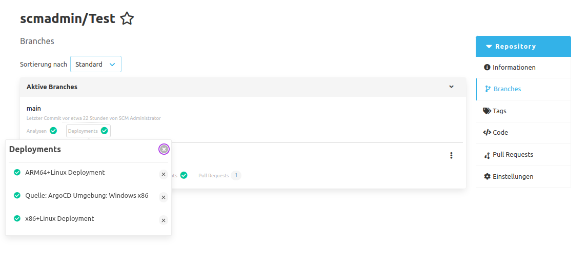
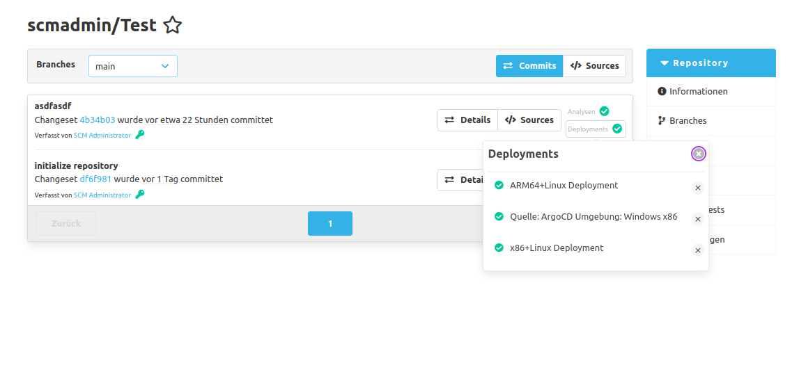
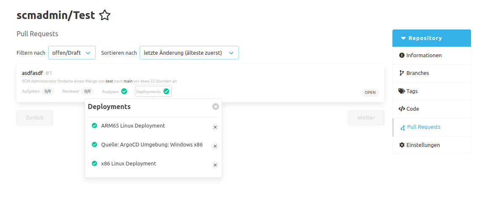

Externe Systeme wie z.B. [ArgoCD](https://argo-cd.readthedocs.io/en/stable/) können unterschiedliche Stände eines Repositorys auschecken und auf Basis dieser Deployments erzeugen.
Das CI-Plugin bietet diesen externen Systemen die Möglichkeit an, den aktuellen Status eines solchen Deployments zu vermerken.
Diese Statusinformationen können sich dabei auf einen konkreten Commit beziehen oder auf einen Pull Request, falls das Review Plugin ebenfalls installiert ist.
Dabei ist es möglich für jeden Commit und Pull Request auch mehrere Deployments mit eigenen Statusinformationen zu hinterlegen.
Eine solche Statusinformation beinhaltet dabei folgende Daten:

- Die Quelle des Deployments. 
  Damit ist das System gemeint, welches das Deployment erzeugt hat. 
  Dies könnte z.B. ArgoCD sein.

- Die Umgebung des Deployments. 
  Hiermit können zusätzliche Umgebungsinformationen über das Deployment angegeben werden.
  Zum Beispiel für welches Betriebssystem und welche CPU-Architektur das Deployment erzeugt wurde.

- Ein Anzeigename.
  Dies ist der Name, mit dem das Deployment im SCM-Manager angezeigt wird.
  Der Anzeigename ist optional und falls keiner gesetzt wurde, wird stattdessen die Quelle und die Umgebungsinformationen angezeigt.

- Eine URL, welche zum Deployment führt.

- Der aktuelle Status des Deployments.
  Der Status kann dabei entweder erfolgreich, fehlgeschlagen oder ausstehend sein.

Diese Statusinformationen werden im SCM-Manager in drei Ansichten gezeigt.
Zum einen in der Branch-Übersicht.
Hier werden die Deployments des neuesten Commits dargestellt, welcher sich auf dem jeweiligen Branch befindet.

Außerdem werden die Deployments in der Commit-Übersicht eines Repositorys dargestellt.
Hier werden alle Deployments des jeweiligen Commits aufgelistet.

Zuletzt werden die Deployments in der Pull Request Übersicht angezeigt.
Hier werden alle Deployments des jeweiligen Pull Requests aufgelistet.

Damit ein Benutzer diese Statusinformationen eines Deployments sehen kann, benötigt er für das jeweilige Repository die Leseberechtigung für CI- und Deployment-Status.
Falls der Benutzer auch die jeweilige Schreibberechtigung hat, ist es auch möglich in der Übersicht von Deployments die Statusinformationen zu einem Deployment zu löschen.
Das Deployment selbst wird allerdings dabei nicht gelöscht oder verändert.
