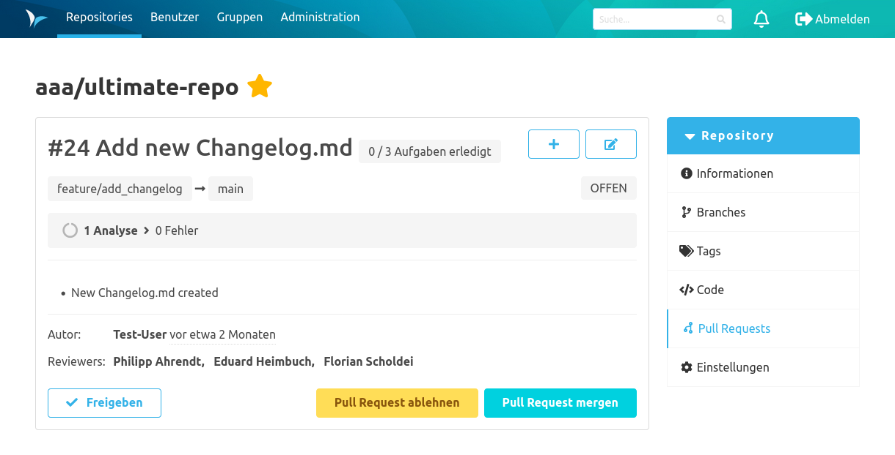
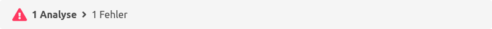

Mit dem Review-Plugin werden Pull Requests im SCM-Manager unterstützt. Das SCM-CI-Plugin kann sich in diese Pull Requests einklinken und sie mit nützlichen Informationen anreichern.

In den Pull Request Details zeigt eine Statusbar Informationen von allen integrierten CI-Systemen für diesen Pull Request an.

Mit nur einer Jenkins Instanz und einem Build-Job für einen Feature-Branch könnte das wie folgt aussehen:

Dieser Statusbalken könnte je Build-Job-Status in folgenden Varianten auftreten:

### Laufend
Der Jenkins-Build-Job ist gestartet und noch nicht abgeschlossen.

### Erfolgreich
Der Jenkins-Build-Job ist erfolgreich durchgelaufen und im Jenkins grün.

### Instabil
Der Jenkins-Build-Job ist gelb. Womöglich sind Unit-Tests fehlgeschlagen.

### Fehlerhaft
Der Jenkins-Build-Job ist rot. Der Job konnte nicht erfolgreich durchlaufen, weil ein Fehler aufgetreten ist.

Sollte dabei nur eine der Analysen fehlschlagen, würde der Statusbalken bereits rot angezeigt werden. Nur wenn alle Analysen fehlerfrei durchlaufen, wird ein grüner Haken angezeigt.
