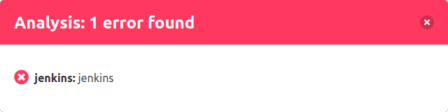

Um weitere Informationen zu den Analysen zu erhalten, öffnet man mit einem Klick auf den Statusbalken einen detaillierten Dialog zu den jeweilgen Status. 

Der Dialog zeigt folgende Informationen an:

- **Status:** Resultat der Analyse als farblicher Icon
- **Typ:** Art des CI-System (In diesem Fall Jenkins)
- **Name:** Name der Analyse (Im diesem Fall heißt der Build-Job "jenkins")
- **Details:** Link zur ausgeführten Analyse bzw. zum Build-Job

