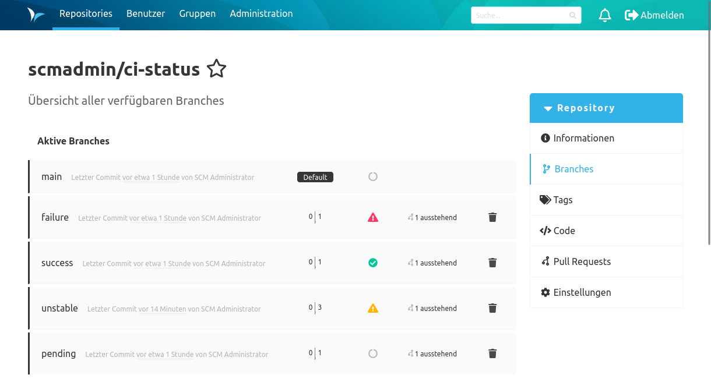
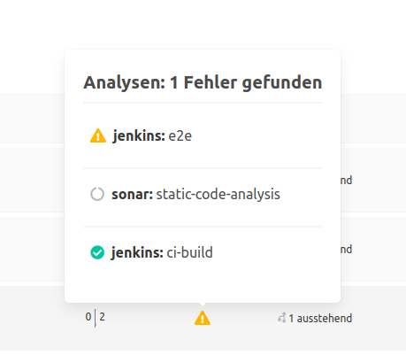

In der Branches Übersicht werden die Status für den jeweils letzten Commit angezeigt.

Fährt man mit der Maus über ein Status-Icon, sieht man in dem Tooltip die Zusammensetzung der Auswertung.

In der Detailansicht zum Branch wird der Status als Statusbalken angezeigt.

