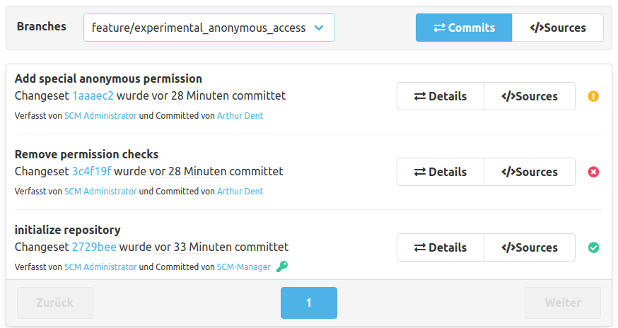
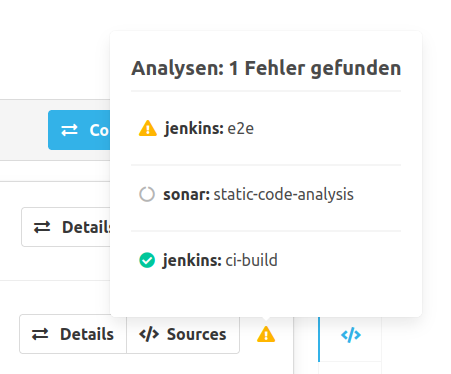

Außer dem Statusbalken für Pull Requests gibt es auch die Möglichkeit sich den Status für jeden einzelnen Commit anzusehen.

Der CI-Status wird in der Liste der Commits rechts über farbliche Icons dargestellt. Diese Icons sind anklickbar und öffnen den gleichen detaillierten Dialog wie beim Klick auf den Statusbalken.

Fährt man mit der Maus über ein Status-Icon, sieht man in dem Tooltip die Zusammensetzung der Auswertung.

