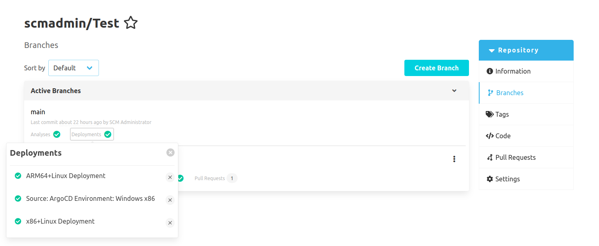
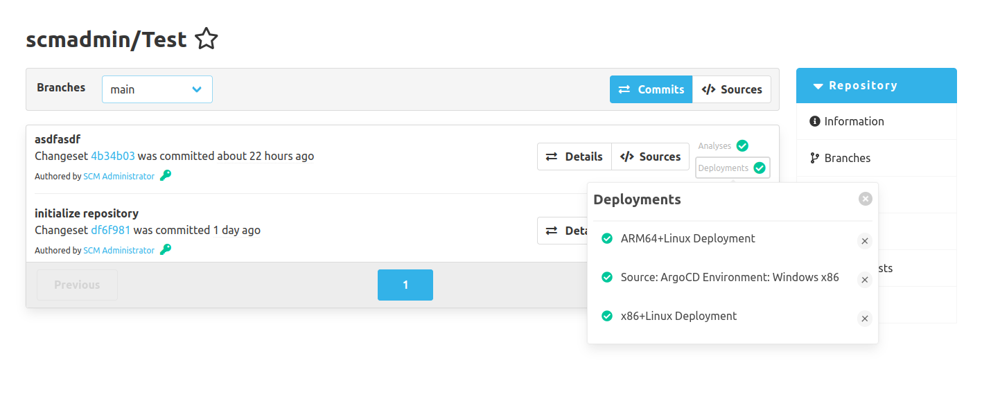
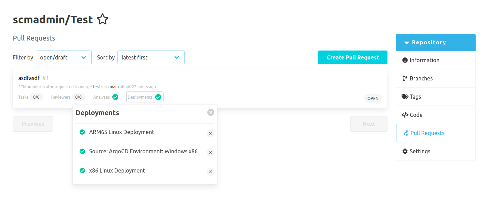

External systems such as [ArgoCD](https://argo-cd.readthedocs.io/en/stable/) can check out different commits of a repository and create deployments based on these.
The CI plugin offers these external systems the option of storing current status information of such a deployment.
Those status information can refer to a specific commit or to a pull request if the review plugin is also installed.
It is also possible to store several deployments with their own status information for each commit and pull request.
Such status information contains the following data:

- The source of the deployment.
  This refers to the system that created the deployment.
  This could be ArgoCD, for example.

- The environment of the deployment.
  This can be used to specify additional environment information about the deployment.
  For example, for which operating system and which CPU architecture the deployment was created.

- A display name.
  This is the name with which the deployment is displayed in the SCM-Manager.
  The display name is optional and if none is set, the source and environment information is displayed instead.

- A URL that leads to the deployment.

- The current status of the deployment.
  The status can either be successful, failed or pending.

This status information is shown in the SCM-Manager in three views.
Firstly, in the branch overview.
The deployments of the latest commit that is located on the respective branch are displayed here.

The deployments are also displayed in the commit overview of a repository.
All deployments of the respective commit are listed here.

Finally, the deployments are displayed in the pull request overview.
All deployments of the respective pull request are listed here.

In order for a user to see this status information of a deployment, they need read authorization for CI and deployment status for the respective repository.
If the user also has the respective write authorization, it is also possible to delete the status information for a deployment in the deployment overview.
However, the deployment itself is not deleted or changed.
