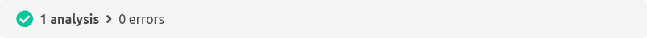

With the review plugin, SCM-Manager supports pull requests. The scm-ci-plugin can link into the pull requests and enrich them with useful information.

In the pull request details a status bar shows information from all CI systems that are integrated for this pull request.

With only one Jenkins instance and one build job for a branch it could look like this:

This status bar could appear in these variations for each build job status: 

### Running
The Jenkins job run has started but not finished yet.

### Successful
The Jenkins build job run was successful and is green in Jenkins.

### Unstable
The Jenkins build job is yellow. Maybe unit tests failed.

### Faulty
The Jenkins build job is red. The run could not be completed because an error occurred.

Even if only one of the analyses is faulty, the status bar would be shown as red. Only if all analyses are completed without any errors it is shown as green.
