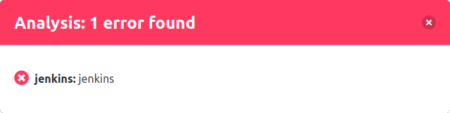

To get more information about the analyses, you can open a detailed dialog about the status by clicking on the status bar.

The dialog shows this information:

- **Status:** Result of the analysis as a colored icon
- **Type:** Type of the CI-System (Jenkins in this case)
- **Name:** Name of the analysis (in this case the build job's name is "jenkins")
- **Details:** Link to the analysis or the build job

