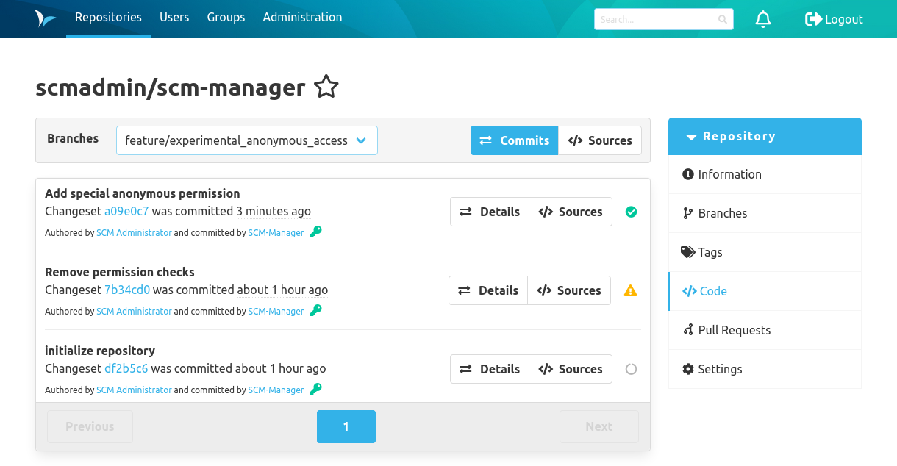

In addition to the status bar for pull requests, there is also the possibility to see the status for each commit.

The CI status is shown in the commit history list. Clicking on the icon opens the same dialog as clicking on the status bar.

Hovering over the icon with the mouse shows a summary of the run in a tooltip.

